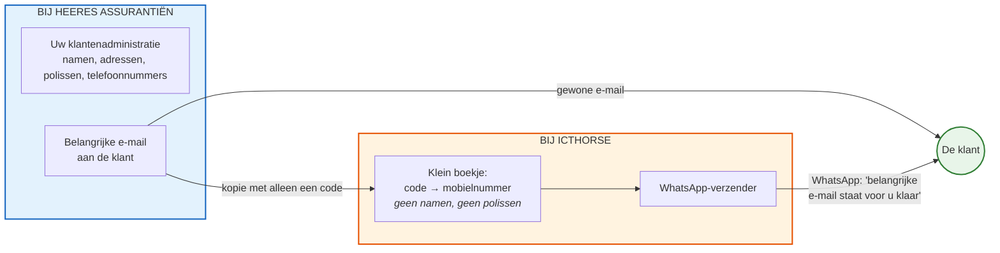
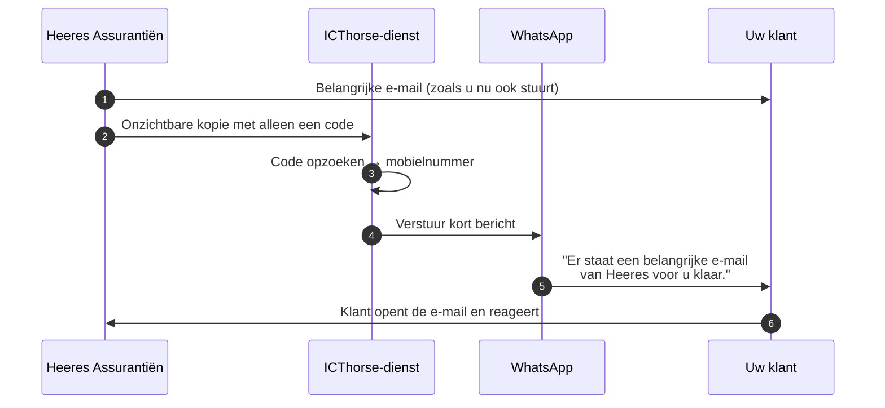
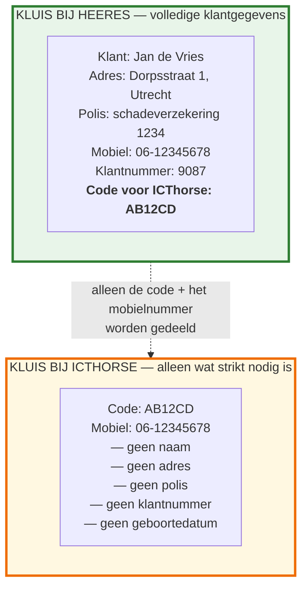
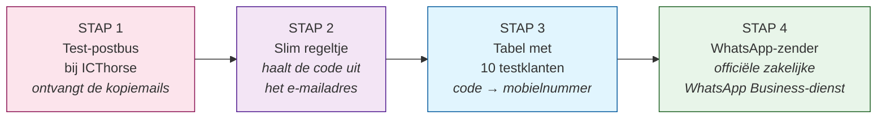
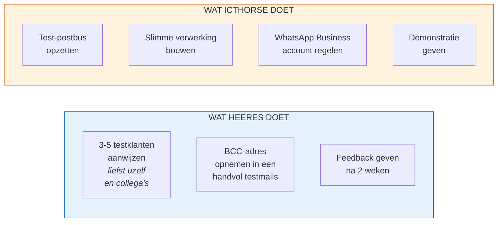

# Veilige notificatieservice — Proof of Concept

*Een voorstel van ICThorse aan de eigenaar van Heeres Assurantiën*

---

## Waarom dit voorstel?

U stuurt regelmatig e-mails aan klanten waar zij écht op moeten reageren:
een polisaanpassing, een ondertekening, een schadebevestiging. Een deel van
uw klanten leest die mail pas dagen later — of helemaal niet. Bellen kost
tijd, een herinneringsmail verdwijnt in dezelfde inbox.

**Het idee:** zodra u zo'n belangrijke mail verstuurt, krijgt de klant
automatisch een kort WhatsApp-bericht: *"Er staat een belangrijke e-mail
van Heeres Assurantiën voor u klaar. Graag reageren."* Niet meer dan dat.
Geen inhoud, geen polisnummers, geen bedragen.

De truc zit hem in **hoe** dat gebeurt. ICThorse bouwt en beheert die
notificatiedienst zó, dat wij **nooit** weten wíé uw klant is. Wij hebben
alleen een mobiel nummer en een onleesbare code. Alle persoonsgegevens
blijven bij u, in uw eigen systeem.

Dat is geen marketingpraatje — dat is hoe het technisch in elkaar zit.
Dit document legt uit hoe.

---

## Het idee in één plaatje

**Twee kanalen, één doel.** De e-mail gaat zoals altijd naar de klant.
Tegelijkertijd gaat een onschuldig "tikje" naar ICThorse, met daarin
**geen klantgegevens** — alleen een code. ICThorse vertaalt die code
intern naar een mobielnummer en stuurt het WhatsApp-bericht.

---

## Wat de klant merkt

Voor de klant is dit een prettige, korte attendering. Hij of zij weet
dat als Heeres via WhatsApp pingt, het ergens om gaat — zonder dat er
vertrouwelijke informatie via WhatsApp gaat.

---

## De kern: twee gescheiden "kluizen"

Dit is het belangrijkste plaatje. Het verklaart waarom dit veilig is.

**Waarom dit zo'n belangrijk plaatje is:**

- **Bij u (Heeres):** alles blijft zoals het is. U heeft de complete
  klantkaart. De code "AB12CD" is een extra veldje in uw systeem,
  willekeurig gegenereerd, dat alleen voor de notificatieservice
  bestaat.
- **Bij ICThorse:** wij weten letterlijk niet wie "AB12CD" is. We zien
  een code en een mobielnummer. We weten niet of het Jan de Vries,
  Pietje Puk of een bedrijf is. We weten niet welke verzekering hij
  heeft.
- **Bij een eventueel lek aan onze kant:** een dief vindt een lijst
  met mobielnummers en onleesbare codes. Geen namen, geen polissen,
  geen klantgegevens. De koppeling terug naar uw klanten zit
  uitsluitend in **uw** systeem.

> **Belangrijke nuance, eerlijk gezegd:** een mobielnummer is op zichzelf
> óók een persoonsgegeven onder de AVG. We claimen dus niet "wij hebben
> geen persoonsgegevens". We claimen wél: *zo weinig mogelijk, en zonder
> context*. Dat is precies wat de AVG ("dataminimalisatie") en NIS2
> ("beperk de schade bij incidenten") van u verwachten.

---

## Wat we gaan bouwen voor de Proof of Concept

Een Proof of Concept is een werkende mini-versie, met een handjevol
testklanten (bijvoorbeeld uzelf en twee collega's), waarmee we laten
zien dat de hele keten werkt. Geen koppeling met uw echte
klantenbestand — dat komt pas als u tevreden bent.

### De vier bouwstenen, uitgelegd

**1. De test-postbus**
Een speciaal e-mailadres bij ICThorse, bijvoorbeeld:
`klant-AB12CD@notify.icthorse.nl`. Het stukje "AB12CD" is de code.
Voor elke testklant maken we zo'n adres aan — of liever: één
postbus die alle codes accepteert. U zet dat adres in BCC ("blind
carbon copy", onzichtbaar) bij de belangrijke e-mail aan de klant.

**2. Het slimme regeltje**
Een klein stukje software dat:
- de binnenkomende mail "ziet"
- de code uit het adres haalt ("AB12CD")
- de inhoud van de mail negéért — die kijken we niet in
- doorgaat naar stap 3

**3. De tabel**
Een eenvoudige lijst met daarin per testklant:

| Code   | Mobielnummer   |
| ------ | -------------- |
| AB12CD | 06-12345678    |
| XY99ZT | 06-87654321    |
| ...    | ...            |

Voor de PoC volstaat een beveiligd spreadsheet of een kleine database.

**4. De WhatsApp-zender**
WhatsApp staat zakelijk versturen toe via "WhatsApp Business" —
een officiële dienst van Meta. We gebruiken een vooraf goedgekeurd
sjabloon, zodat WhatsApp er zeker van is dat het geen reclame is.
Het bericht is altijd hetzelfde:

> *"Geachte relatie, er staat een belangrijke e-mail van Heeres
> Assurantiën voor u klaar. Wilt u deze openen en — indien nodig —
> reageren? — Heeres Assurantiën via ICThorse."*

---

## Wat de PoC bewijst — en wat (nog) niet

### Wat we ná de PoC zwart op wit kunnen aantonen

- De keten werkt end-to-end: u stuurt een mail, de klant krijgt
  binnen seconden een WhatsApp.
- ICThorse heeft op géén enkel moment toegang tot de inhoud van uw
  e-mails of tot identificeerbare klantgegevens.
- Bij een test-datalek (we zetten de ICThorse-tabel zelf in het
  zicht) is niet te herleiden wie de klanten zijn.
- Uw klanten reageren positief — of geven feedback waar we mee
  verder kunnen.
- We hebben een realistisch beeld van de kosten per notificatie.

### Wat de PoC nog niet is

- Geen koppeling met uw eigen klantsysteem — dat doen we pas in fase 2.
- Geen formele audit (SOC 2, ISO 27001) — daar werken we naartoe, maar
  zo'n audit duurt maanden en kost geld dat u nu nog niet uitgeeft.
- Geen verwerkersovereenkomst getekend voor productiegebruik — dat
  regelen we vóór we met echte klanten beginnen.
- Niet getest met honderden tegelijk verstuurde berichten.

> Eerlijk is eerlijk: een PoC laat zien dat *het idee* werkt. Hij is
> nog niet productieklaar. Maar hij geeft u — en mij — de zekerheid
> dat we het juiste aan het bouwen zijn vóórdat we er echt in
> investeren.

---

## Wat moet u doen — en wat doet ICThorse?

Uw inspanning voor de PoC is bewust laag: een paar testklanten kiezen,
een BCC-adres in een paar mails zetten, en na twee weken vertellen wat
u ervan vindt. Verder doet ICThorse het werk.

---

## Tijdsindicatie en kosten

| Fase                                          | Duur          | Wie?          |
| --------------------------------------------- | ------------- | ------------- |
| Opzetten test-postbus + slim regeltje         | 1 week        | ICThorse      |
| WhatsApp Business account + sjabloon-goedkeuring | 1-2 weken*  | ICThorse      |
| Testklanten kiezen en BCC-adres gebruiken     | 2 weken       | Heeres        |
| Evaluatie en gezamenlijk besluit              | 1 dag         | Samen         |

*De goedkeuring van het WhatsApp-sjabloon ligt bij Meta en kan
soms een paar dagen, soms langer duren. Dat is een wachttijd, geen
werktijd.

**Kosten van de PoC:** voor de fase die hierboven staat is het
voornemen dat ICThorse de bouw voor eigen rekening uitvoert. U
betaalt alleen de werkelijk verzonden WhatsApp-berichten — voor een
PoC met 5 testklanten en pakweg 20 berichten is dat verwaarloosbaar
(enkele euro's).

---

## Voordelen — voor u en voor uw klanten

**Voor Heeres Assurantiën**

- Klanten reageren sneller op belangrijke mails: minder
  nabeltijd, minder vertraging in dossiers.
- Aantoonbaar privacy-bewust: u kunt richting toezichthouder en
  klanten laten zien dat u méér doet dan wettelijk verplicht is.
- Geen verandering in uw eigen werkwijze: u blijft mailen zoals u
  altijd deed; alleen het BCC-veld komt erbij.
- Geen IT-aanpassingen aan uw kant nodig voor de PoC.

**Voor uw klanten**

- Een attente, korte herinnering via een kanaal dat zij élke dag
  toch al gebruiken.
- Géén gevoelige informatie via WhatsApp. Veiliger dan
  notificatie-apps die de inhoud meesturen.
- Zekerheid: als Heeres via WhatsApp pingt, weten ze dat het ergens
  om gaat.

---

## En de juridische kant?

Korte, eerlijke samenvatting:

- **AVG / GDPR:** wat we doen heet officieel "pseudonimisering". Dat
  is een door de AVG aanbevolen techniek. Het haalt de dienst niet
  buiten de AVG, maar verkleint de impact bij incidenten enorm. We
  sluiten vóór productie een verwerkersovereenkomst.
- **NIS2:** als Heeres onder NIS2 valt (waarschijnlijk indirect, via
  uw verzekeraars), helpt deze opzet bij het aantonen van "supply
  chain"-controle: uw leveranciers (zoals ICThorse) hebben niet meer
  data dan strikt nodig.
- **SOC 2:** is een audit die ICThorse op termijn nastreeft. Voor de
  PoC nog niet relevant; we werken alvast volgens de principes
  (toegangsbeheer, logging, scheiding van omgevingen).
- **WhatsApp Business:** Meta is een verwerker. We gebruiken hun
  officiële zakelijke kanaal, niet een "gewone" WhatsApp-account.
  Hier hangt een eigen contract aan dat we transparant met u delen.

---

## Volgende stappen

1. **Korte sessie van een uur** waarin we dit voorstel doorlopen en
   uw vragen beantwoorden.
2. **Akkoord op de PoC** — een eenvoudige projectafspraak op één A4.
3. **Twee weken bouwen**, dan een live demonstratie met een testmail
   aan u.
4. **Twee weken testen** met een handjevol klanten.
5. **Evaluatie** en samen beslissen of we naar fase 2 gaan
   (uitbreiding, koppeling met uw systeem, verwerkersovereenkomst,
   formele audit-voorbereiding).

Geen verplichting tussen stap 4 en stap 5. Als u na de demo zegt
"leuk geprobeerd, niets voor mij", dan is dat het. Geen
abonnement, geen lock-in.

---

*Opgesteld door ICThorse — versie voor bespreking met de eigenaar
van Heeres Assurantiën.*
